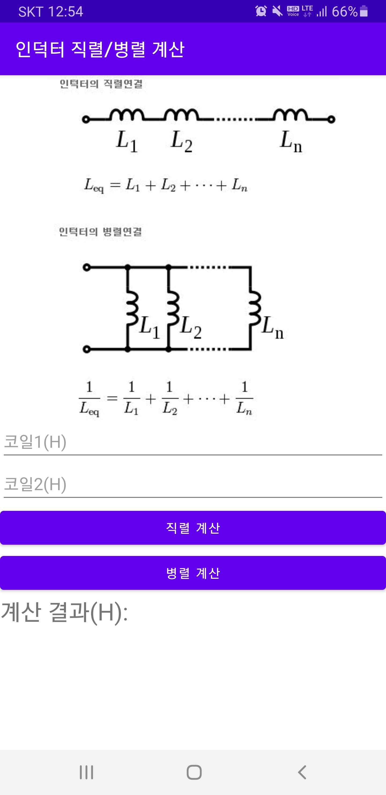
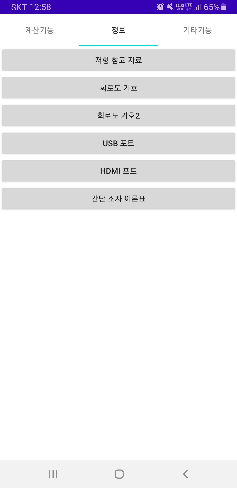
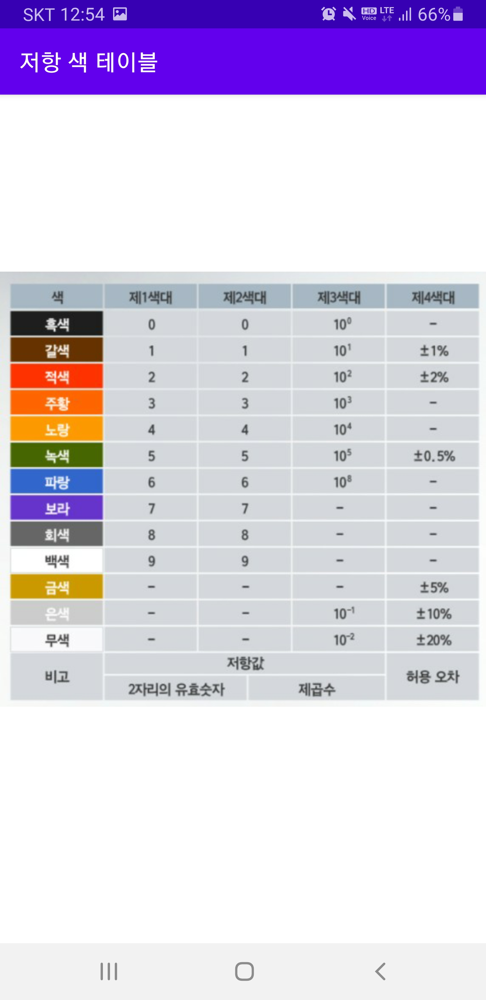
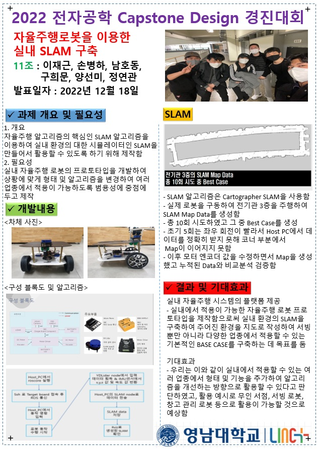

# :star2:간단한 이력서 만들기 [손병하]

> 이 문서는 손병하의 포트폴리오 프로토타입 입니다.

## [이 사람은 어떤 사람인가?]

### :floppy_disk: [profile]

 이름 : 손 병 하

- 생년월일: 1997 / 04 / 06
- 연락처: 010-4425-9674
- Github: https://github.com/sonbyungha

### :globe_with_meridians: [학력]

영남대학교, 2016-03 ~ 2022 - 02

- 주전공: 전자공학과
- 학점: 3.56 / 4.50
- 졸업논문 주제 : 자율주행 차량을 이용한 SLAM 데이터 구축

### [경험]

- :seedling: 간단한 모바일 프로그래밍 어플 제작
  
  

    
  
  

    
    
  

- :seedling: 경진대회 참여

